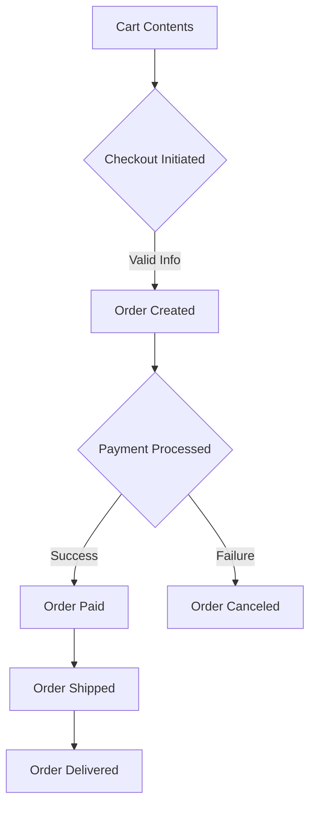
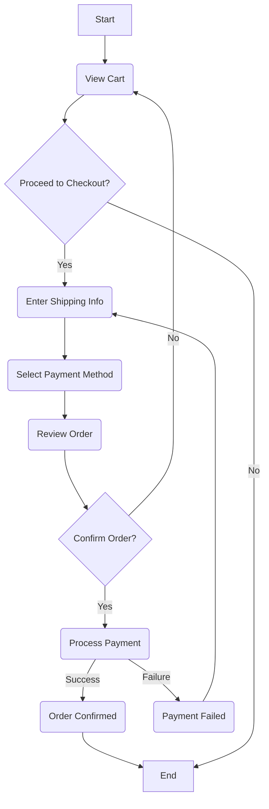

# State Diagrams

## Order Process State Diagram (simplified)

```mermaid
graph TD
    A[Cart Contents] --> B{Checkout Initiated};
    B -- Valid Info --> C[Order Created];
    C --> D{Payment Processed};
    D -- Success --> E[Order Paid];
    D -- Failure --> F[Order Canceled];
    E --> G[Order Shipped];
    G --> H[Order Delivered];
```

## Checkout Process Activity Diagram (simplified)

```mermaid
graph TD
    A[Start] --> B(View Cart);
    B --> C{Proceed to Checkout?};
    C -- Yes --> D(Enter Shipping Info);
    D --> E(Select Payment Method);
    E --> F(Review Order);
    F --> G{Confirm Order?};
    G -- Yes --> H(Process Payment);
    H -- Success --> I(Order Confirmed);
    H -- Failure --> J(Payment Failed);
    J --> D;
    I --> K[End];
    C -- No --> K[End];
    G -- No --> B;
```
